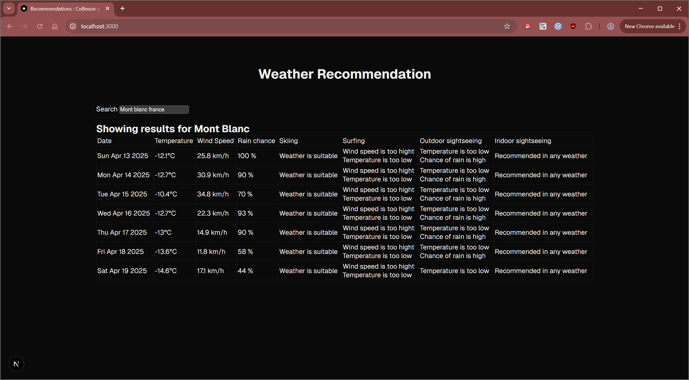
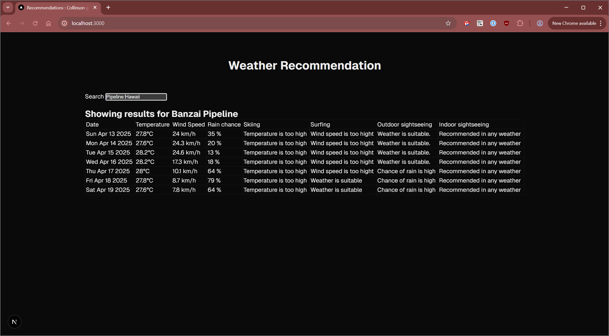

# Collinson Group Take-Home Test

2025-04-13 - By Michael Doyle [email](mailto:mdoyle@mdoyle.org) | [linkedin](https://www.linkedin.com/in/mdoyle/)

## About

I've created a node/express [API](api/package.json) and a react/next.js [front-end](react-app/package.json) to implement the [scenario](./scenario.md).

These can be run using standard NPM commands; onces started they will be available at these URLs:  
api: http://localhost:3005  
UI: http://localhost:3000

### API endpoints

- [Location](.api/src/controllers/location.ts)  
  e.g. `{url}/location?textQuery=London`  
  This returns a list of places and their geo-coordinates, it uses [google places](https://developers.google.com/maps/documentation/places/web-service/overview) API as the data-source.

- [Recommendations](./api/src/controllers/recommendation.ts)  
  e.g. `{url}/recommendation?latitude=51.5072&longitude=-0.1275861`  
  This returns a recommendation for each activity over the next 7 days.  
  It uses the [Open-meteo api](./api/src/datasources/openMeteo.ts) and a series of "[heuristics](./api/src/util/makeRecommendations.ts)" to determine the suitability of each activity-type.

### front-end

This is a simple [react page](react-app/src/app/page.tsx).

- When first loaded a search box is shown.
- When the user types something a location call is made;
- If there are multiple options they are displayed for the user to choose from; if just one is found it is automatically selected.
- Once a location is set, a call is made to Recommendations and the results displayed in a table.

### Things to-do

- Most notably there is no check (other than weather) that the location is suitable for any of the activities.
- API documentation
- The UX is rudimentary
- The react page should be broken up into smaller files
- More unit-tests

These were left primarily due to lack of time. Determining whether a given location is suitable for an activity is quite difficult.

### This is what it looks like

  

